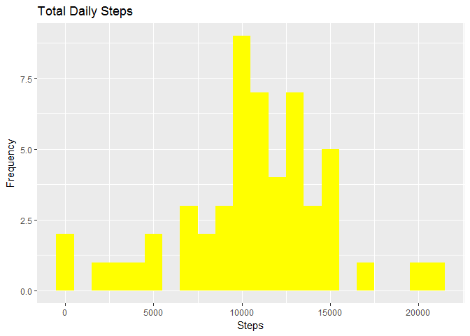
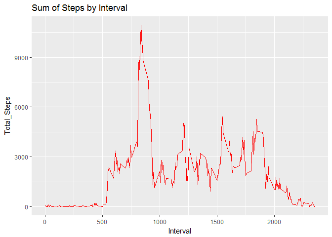
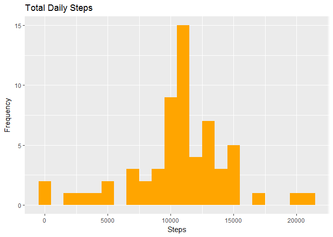
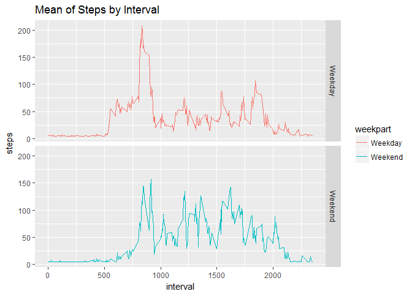

# PA1_submission
Anzisca  
07 December 2017  


Reading the data into R

```r
setwd("C:/Users/anzisca.vanrooyen/Desktop/RepData_PeerAssessment1")
DATA <-read.csv("activity.csv")
```
Transform format to required type 

change date type to date class 

```r
DATA$date <- as.Date(as.character(DATA$date))
```
Exclude Nulls

```r
NAomit_DATA <-  na.omit(DATA)
```
## 1. Total number of steps taken per day

```r
MeansStepsByDay <- setNames(aggregate(NAomit_DATA$steps, by=list(NAomit_DATA$date), sum),c("Date","Total_Steps"))
```
Histogram: Total number of steps taken per day
Load library


```r
library(ggplot2)
```

Histrogram plot


```r
ggplot(MeansStepsByDay, aes(x = Total_Steps)) +
geom_histogram(fill = "yellow", binwidth=1000) +
labs(title = "Total Daily Steps", x = "Steps", y = "Frequency")
```

<!-- -->

# 2. Mean and Median Total number of steps taken per day
Mean number of steps 


```r
mean(MeansStepsByDay$Total_Steps)
```

```
## [1] 10766.19
```
Median number of steps 


```r
median(MeansStepsByDay$Total_Steps)
```

```
## [1] 10765
```

# 3. Average daily activity pattern  

```r
MeansStepsByInterval <- setNames(aggregate(NAomit_DATA$steps, by=list(NAomit_DATA$interval), sum),c("Interval","Total_Steps"))


ggplot(MeansStepsByInterval, aes(x = Interval, y=Total_Steps)) +
  labs(title = "Sum of Steps by Interval", x = "Interval", y = "Total_Steps")+
  geom_line(color="red") 
```

<!-- -->
The time interval has the maximum number of steps: 


```r
MeansStepsByInterval[which.max(MeansStepsByInterval$Total_Steps),]
```

```
##     Interval Total_Steps
## 104      835       10927
```

#4. Total number of steps , missing values substituted

Impute missing values 
Number of missing rows:

```r
nrow(is.na(DATA))
```

```
## [1] 17568
```

-Replace all missing values with aggregate measures
-Using na.aggregate from Zoo I am able to loop through the columns of the dataset
-Mean number of steps taken per data, Missing values substituted

```r
library(zoo)
```

```
## 
## Attaching package: 'zoo'
```

```
## The following objects are masked from 'package:base':
## 
##     as.Date, as.Date.numeric
```

```r
DATA2 <- DATA
DATA2[] <- lapply(DATA2, na.aggregate)

MeansStepsByDayInclNa <- setNames(aggregate(DATA2$steps, by=list(DATA2$date), sum),c("Date","Total_Steps"))
```
Histogram number of steps taken each day , Missing values substituted
Replacing the missing values with averages does not seem to change the average number of daily steps each day. Its does however moved the median towards the mean values

```r
ggplot(MeansStepsByDayInclNa, aes(x = Total_Steps)) +
geom_histogram(fill = "Orange", binwidth=1000) +
labs(title = "Total Daily Steps", x = "Steps", y = "Frequency")
```

<!-- -->
#5. Mean and Median Total number of steps taken per day , missing values substituted

Mean number of steps, Missing values substituted


```r
mean(MeansStepsByDayInclNa$Total_Steps)
```

```
## [1] 10766.19
```
Median number of steps, Missing values substituted 


```r
median(MeansStepsByDayInclNa$Total_Steps)
```

```
## [1] 10766.19
```

#6. number of steps taken, averaged across all weekdays and weekends, missing values substituted
Add weekday and weekend functions 

```r
DATA2$weekday <- weekdays(DATA2$date)
DATA2$weekend <- ifelse (DATA2$weekday == "Saturday" | DATA2$weekday == "Sunday", "Weekend", "Weekday")
DATA2$weekpart <- as.factor(DATA2$weekend)
```

Panel plot  5-minute interval (x-axis) and the average number of steps taken, averaged across all weekday days or weekend days

```r
MeanDataWeekendWeekday <- aggregate(DATA2$steps, by=list(DATA2$weekpart, DATA2$interval), mean)
names(MeanDataWeekendWeekday)[1] ="weekpart"
names(MeanDataWeekendWeekday)[2] ="interval"
names(MeanDataWeekendWeekday)[3] ="steps"
```

```r
ggplot(MeanDataWeekendWeekday, aes(x = interval, y=steps, color=weekpart)) +
  geom_line() +
  facet_grid(weekpart ~ .) +
  labs(title = "Mean of Steps by Interval", x = "interval", y = "steps")
```

<!-- -->

